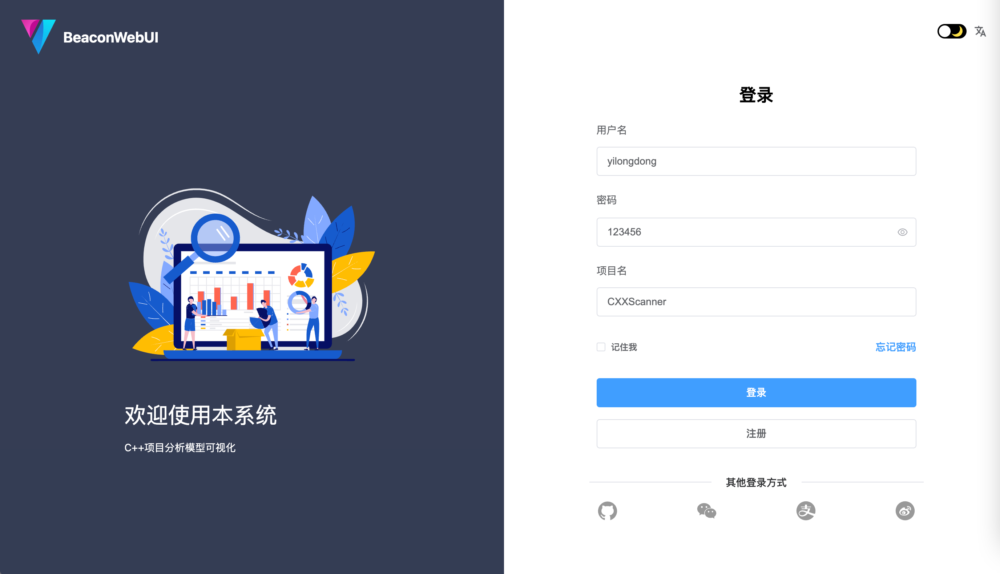
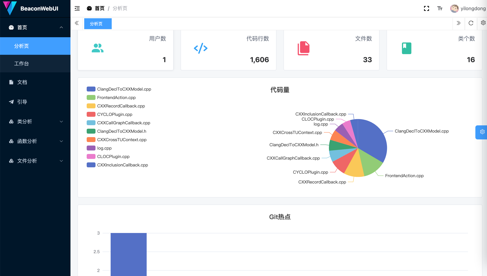
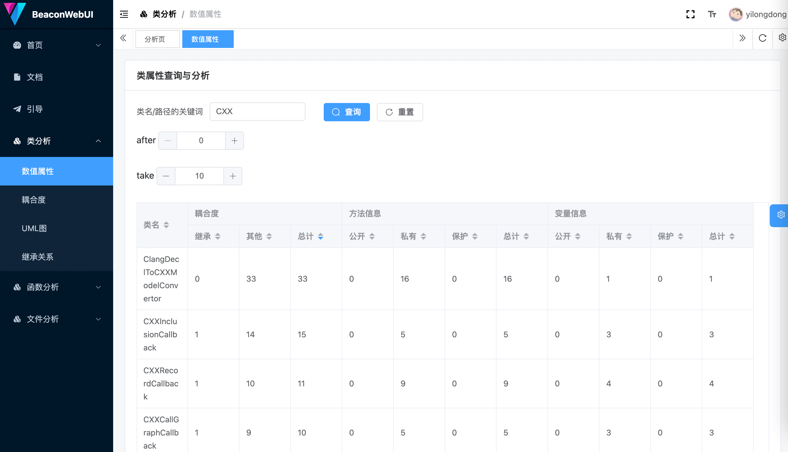
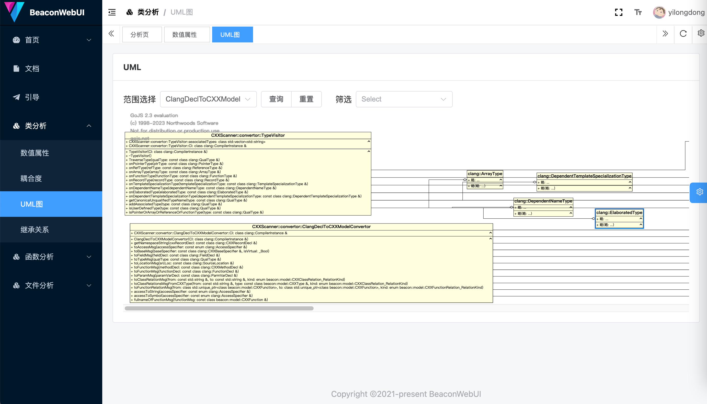
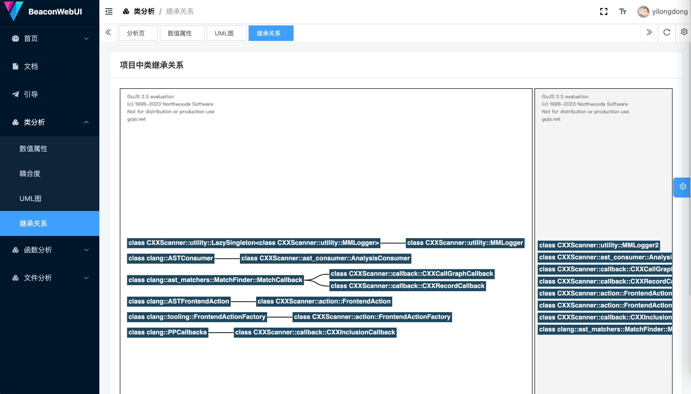
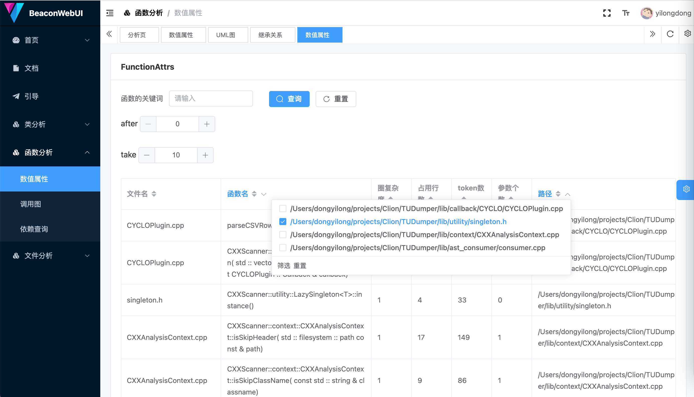
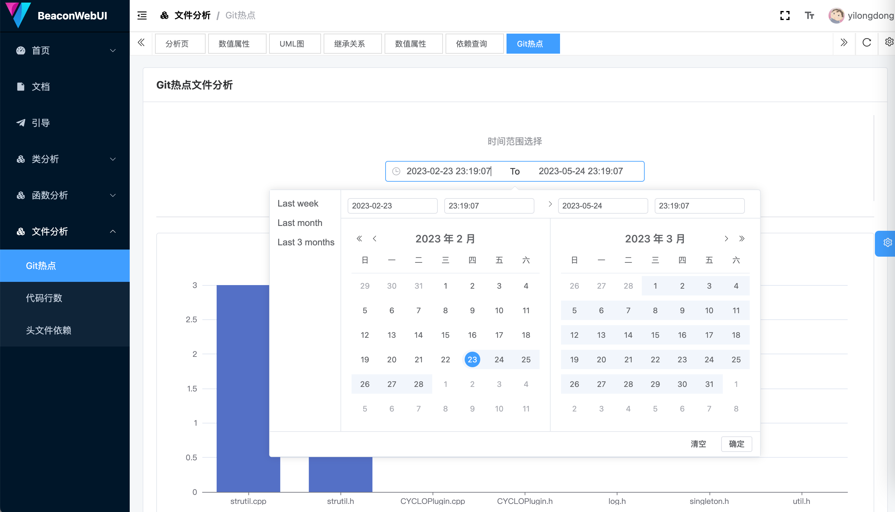
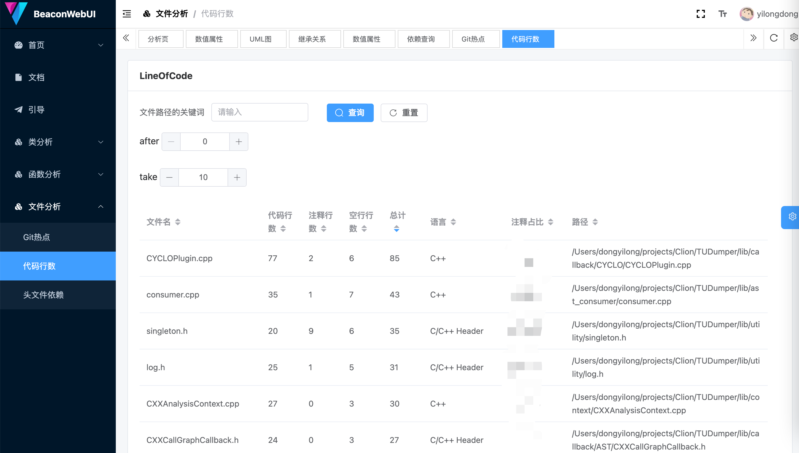
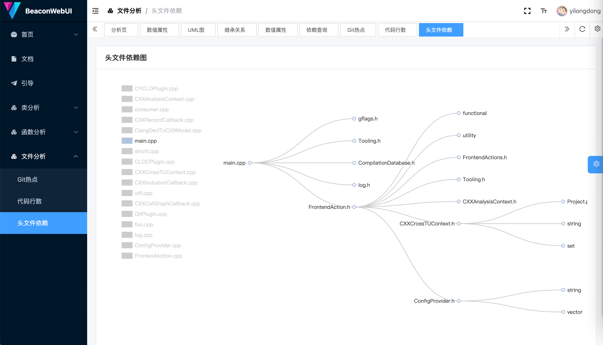
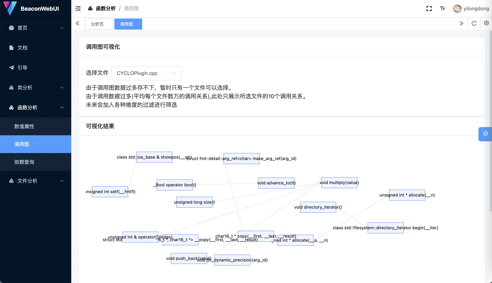

# Beacon WebUI
用于可视化CXXScanner获得的C++项目分析模型而写的一个前端

这个前端需要搭配Beacon Server和CXXScanner才能用。

1. CXXScanner根据配置文件扫描C++项目，生成分析模型文件。

2. 将分析模型上传到Beacon Server，Server会将数据存到MongoDB里。

3. 然后通过这个WebUI进行一些查询统计和可视化之类的。

因为不会写前端，所以写的很烂。

因为不会写后端，所以写的很烂。

也因为不会写扫描器，所以写的也很烂。

效果如下图

